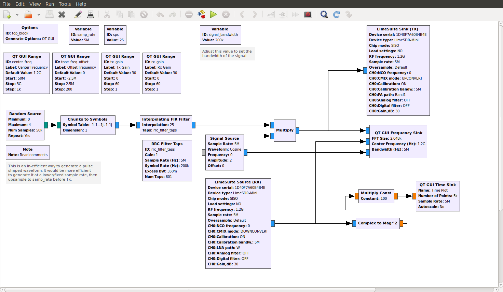

# gr-limesdr-examples
GNURadio LimeSDR-Mini Examples
## Description
This is a collection of working projects for the LimeSDR Mini. 
They will all likely work for the full LimeSDR by simply changing the target device serial and type.

## Projects
All projects assume you have installed gnu-radio and [gr-limesdr](https://github.com/myriadrf/gr-limesdr). These have only been tested on Ubuntu 18.04.1 TLS.
### loopback_tone.grc
This project illustrates how to generate and recieve a simple tone using gr-limesdr.
Before running this project be sure to cable the selected Tx port to the selected Rx port and include at least a 10 dB attenuator in line. By default the Tx gain is set very low.

### wbfm_generator_from_file.grc

### qam_generator.grc
This project illustrates how to generate a pulse shaped QPSK waveform. The GUI provides controls for Tx and Rx gain, center frequency and offset frequency. The frequency offset is performed by multiplying the source signal by a complex sinusoid, instead of using the LimeSDR frequency offset freture. You can also use that instead by simply putting the offset variable on that config option in the Tx block. To run this project cable the Tx to the Rx port with at least a 10 dB attenuator in line.

